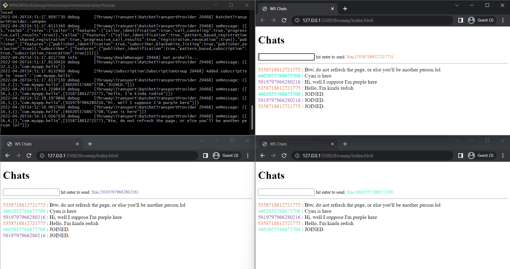

# reactphp-thruway-websocket-chats

## Description
Example **ReactPHP** Project : **Websocket Chats**. With the help of **Thruway** as PHP Router Library for **Autobahn** (use autobahn-browser as a client) Real-Time Application Messaging.

## Install
After clone and `cd` to this project. Install composer dependency
```bash
composer update
```

## Run
1. WebSocket Server
   ```bash
   php ws-router.php
   ```
2. Client
   
   Just visit `index.html` with your browser (I use Live Server from VS Code). Open `index.html` with multiple browser to see the realtime chat goes on.

   
